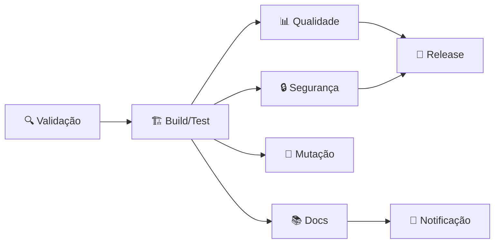

# 🚀 Guia do Pipeline CI/CD

Este documento detalha o pipeline de CI/CD implementado para o projeto de testes unitários.

## 📋 Índice

- [Visão Geral](#visão-geral)
- [Estrutura do Pipeline](#estrutura-do-pipeline)
- [Workflows Disponíveis](#workflows-disponíveis)
- [Configuração](#configuração)
- [Monitoramento](#monitoramento)
- [Troubleshooting](#troubleshooting)

## 🎯 Visão Geral

O pipeline CI/CD foi projetado para garantir qualidade, segurança e entrega contínua do código. Com **complexidade baixa**, é fácil de entender e manter.

### Benefícios

- ✅ **Qualidade garantida**: Testes automatizados em cada push
- 🔒 **Segurança**: Análise de vulnerabilidades contínua
- 📊 **Transparência**: Relatórios detalhados de cobertura
- 🚀 **Deploy automatizado**: Releases com um clique
- 🌍 **Multi-plataforma**: Testes em Linux, Windows e macOS

## 🏗️ Estrutura do Pipeline

### 1. Pipeline Principal (`maven.yml`)

O workflow principal executa em 8 jobs paralelos e sequenciais:



#### Jobs Detalhados:

1. **🔍 Validação e Setup**
   - Verifica duplicação de execuções
   - Extrai versão do projeto
   - Prepara ambiente

2. **🏗️ Build e Testes**
   - Matriz: 3 SOs × 3 versões Java = 9 combinações
   - Executa testes unitários
   - Gera relatórios de cobertura
   - Cache inteligente de dependências

3. **📊 Análise de Qualidade**
   - SonarCloud para métricas de código
   - Codecov para visualização de cobertura
   - Verificação de cobertura mínima (80% linhas, 75% branches)

4. **🔒 Análise de Segurança**
   - OWASP Dependency Check
   - CodeQL para vulnerabilidades
   - Relatórios em HTML

5. **🧬 Testes de Mutação** (apenas em PRs)
   - PITest para qualidade dos testes
   - Threshold de 80% de mutantes mortos

6. **📚 Documentação**
   - Javadoc automático
   - Site Maven com relatórios
   - Upload de artefatos

7. **🚀 Release** (apenas em main)
   - Criação de tags
   - Empacotamento de JARs
   - Deploy no GitHub Packages

8. **📢 Notificações**
   - Resumo no GitHub
   - Comentários automáticos em PRs
   - Status badges

### 2. Análise de Dependências (`dependency-review.yml`)

Executado em PRs que modificam `pom.xml`:

- 🔍 Verifica vulnerabilidades conhecidas
- 📜 Analisa licenças (bloqueia GPL-3.0, AGPL-3.0)
- 💬 Comenta resumo no PR

### 3. Análise de Segurança (`codeql.yml`)

Execução programada e em pushes:

- 🔐 Análise estática de segurança
- 🐛 Detecção de bugs complexos
- 📊 Queries estendidas de segurança

### 4. Release Automatizado (`release.yml`)

Acionado por tags ou manualmente:

- 📦 Build e empacotamento
- 📝 Changelog automático
- 🏷️ Criação de release no GitHub
- 📤 Deploy no GitHub Packages

## ⚙️ Configuração

### Secrets Necessários

Configure os seguintes secrets no repositório:

| Secret | Descrição | Obrigatório |
|--------|-----------|-------------|
| `SONAR_TOKEN` | Token do SonarCloud | ✅ |
| `CODECOV_TOKEN` | Token do Codecov | ❌ |
| `FOSSA_API_KEY` | Chave API do FOSSA | ❌ |

### Configuração do SonarCloud

1. Acesse [sonarcloud.io](https://sonarcloud.io)
2. Importe o projeto do GitHub
3. Copie o token gerado
4. Adicione como secret `SONAR_TOKEN`

### Badges do README

Adicione ao seu README:

```markdown
[](https://github.com/USER/REPO/actions)
[](https://sonarcloud.io/dashboard?id=KEY)
[](https://sonarcloud.io/dashboard?id=KEY)
```

## 📊 Monitoramento

### Dashboard de Actions

Acesse `Actions` no GitHub para:

- 📈 Ver histórico de execuções
- 🔍 Analisar logs detalhados
- 📥 Baixar artefatos
- 🔄 Re-executar workflows

### Métricas Importantes

1. **Tempo de Build**: ~5-10 minutos
2. **Cobertura**: Mínimo 80%
3. **Taxa de Sucesso**: Ideal > 95%
4. **Vulnerabilidades**: Zero críticas

### Notificações

Configure notificações em:
- Settings → Notifications → GitHub Actions

## 🔧 Troubleshooting

### Problema: Build falha com Java 23

**Solução**: Adicione ao `pom.xml`:
```xml
<argLine>-Dnet.bytebuddy.experimental=true</argLine>
```

### Problema: SonarCloud não reporta cobertura

**Solução**: Verifique o caminho do relatório:
```xml
<sonar.coverage.jacoco.xmlReportPaths>
  ${project.build.directory}/site/jacoco/jacoco.xml
</sonar.coverage.jacoco.xmlReportPaths>
```

### Problema: Testes falham no Windows

**Solução**: Normalize caminhos de arquivo:
```java
Path path = Paths.get("test", "file.txt");
```

### Problema: Cache não funciona

**Solução**: Verifique a chave do cache:
```yaml
key: ${{ runner.os }}-maven-${{ hashFiles('**/pom.xml') }}
```

## 🎯 Boas Práticas

### 1. Commits Semânticos

Use prefixos padrão:
- `feat:` Nova funcionalidade
- `fix:` Correção de bug
- `docs:` Documentação
- `test:` Testes
- `ci:` Mudanças no CI/CD

### 2. Branch Protection

Configure em Settings → Branches:
- ✅ Require PR reviews
- ✅ Require status checks
- ✅ Require branches up to date
- ✅ Include administrators

### 3. Otimização de Performance

- Use cache sempre que possível
- Execute jobs em paralelo
- Skip testes desnecessários com `[skip ci]`
- Use `paths-ignore` para arquivos não relevantes

### 4. Segurança

- Nunca commite secrets
- Use variáveis de ambiente
- Revise dependências regularmente
- Mantenha Actions atualizadas

## 📚 Recursos Adicionais

### Documentação Oficial
- [GitHub Actions](https://docs.github.com/actions)
- [SonarCloud](https://docs.sonarcloud.io)
- [Codecov](https://docs.codecov.com)
- [OWASP Dependency Check](https://owasp.org/www-project-dependency-check/)

### Exemplos de Workflows
- [actions/starter-workflows](https://github.com/actions/starter-workflows)
- [actions/example-workflows](https://github.com/actions/example-workflows)

### Ferramentas Úteis
- [act](https://github.com/nektos/act) - Executar Actions localmente
- [actionlint](https://github.com/rhysd/actionlint) - Linter para workflows

## 🤝 Contribuindo com o CI/CD

Para melhorar o pipeline:

1. Crie uma branch `ci/melhoria-xyz`
2. Teste localmente com `act`
3. Documente mudanças neste guia
4. Abra PR com label `ci/cd`

---

<div align="center">
  <p><strong>Pipeline CI/CD:</strong> Garantindo qualidade em cada commit! 🚀</p>
  <p>Dúvidas? Abra uma issue com label <code>ci/cd</code></p>
</div> 